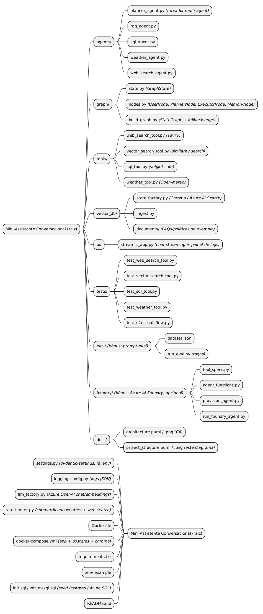
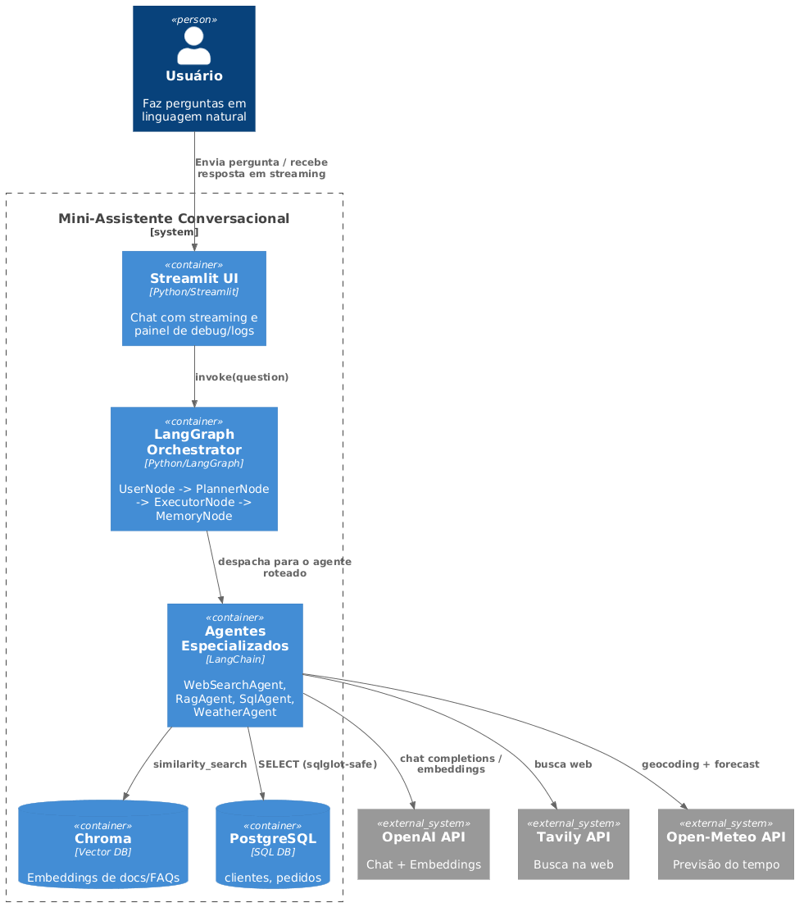

# Mini-Assistente Conversacional RAG Multi-Agent

Assistente conversacional que orquestra múltiplos agentes especializados via
**LangChain + LangGraph**, com interface em **Streamlit** (chat com streaming + painel de
logs/debug). O modelo decide sozinho, a partir da pergunta do usuário, qual capacidade acionar:

- **Busca na web** (Tavily)
- **RAG / similaridade vetorial** (Chroma, sobre FAQs/políticas ingeridas)
- **Consulta SQL** (PostgreSQL, via query gerada por LLM e validada com `sqlglot`)
- **Previsão do tempo** (Open-Meteo, sem necessidade de API key)

## Como rodar

```bash
git clone <repo>
cd <repo>
cp .env.example .env   # preencha AZURE_OPENAI_API_KEY, AZURE_OPENAI_ENDPOINT e TAVILY_API_KEY
docker compose up --build
```

**URL da UI:** http://localhost:8501

Na primeira subida, popule a base vetorial rodando dentro do container `app`:

```bash
docker compose exec app python -m vector_db.ingest
```

(O Postgres já vem populado automaticamente pelo `init.sql` montado no container, com as
tabelas `clientes` e `pedidos`.)

## Estrutura do projeto

```
/agents        # um agente por capacidade (planner, rag, sql, weather, web_search)
/graph         # nós e edges do LangGraph (UserNode, PlannerNode, ExecutorNode, MemoryNode)
/tools         # tools isoladas, entrada/saída tipadas em Pydantic
/vector_db     # script de ingestão + documentos/FAQs de exemplo
/ui            # app Streamlit (chat streaming + painel de logs)
/tests         # testes unitários por tool + testes E2E do fluxo completo
/eval          # avaliação automatizada (prompt-eval com ragas) — bônus
/foundry       # Azure AI Foundry Agent Service (bônus, opcional) — ver foundry/README.md
/docs
  architecture.puml       # diagrama C4 (container), fonte
  architecture.png        # diagrama C4 renderizado
  project_structure.puml  # diagrama da árvore de pastas/arquivos, fonte
  project_structure.png   # diagrama da árvore de pastas/arquivos, renderizado
settings.py            # config central (pydantic-settings, lê o .env)
logging_config.py      # logging estruturado em JSON
llm_factory.py         # factory central dos clientes Azure OpenAI (chat + embeddings)
rate_limiter.py        # rate limiter compartilhado (weather + web search)
docker-compose.yml
Dockerfile
init.sql              # seed do Postgres (tabelas clientes/pedidos)
init_mssql.sql         # equivalente T-SQL, para Azure SQL (bônus Foundry)
```



## Arquitetura

```
Usuário → Streamlit (chat, streaming) → LangGraph.invoke(question)
                                              │
                    UserNode → PlannerNode (LLM decide a rota) → ExecutorNode
                                              │
                    ┌───────────┬─────────────┼─────────────┐
              WebSearchAgent  RagAgent     SqlAgent   WeatherAgent
                    │             │             │           │
                Tavily API   Chroma(vecDB)  Postgres   Open-Meteo API
                                              │
                              (RAG sem contexto) → fallback: WebSearchAgent
                                              │
                                         MemoryNode (histórico da conversa)
```

O `PlannerNode` e o agente executor recebem os últimos turnos de `history` (persistidos pelo
`MemoryNode` via checkpointer do LangGraph) como contexto — perguntas de acompanhamento tipo
"e no Rio?" depois de uma pergunta sobre o clima em São Paulo são resolvidas corretamente. Os
`logs` de debug, por outro lado, são reiniciados a cada turno (não acumulam entre perguntas),
para o painel lateral da UI não duplicar entradas de turnos anteriores.



Ver `docs/architecture.puml` (fonte) / `docs/architecture.png` (renderizado) para o diagrama
C4 completo. Para regenerar qualquer um dos dois PNGs (`architecture.png` ou
`project_structure.png`) após editar o `.puml` correspondente:

```bash
docker run --rm -v "$(pwd)/docs:/docs" plantuml/plantuml -tpng /docs/architecture.puml
docker run --rm -v "$(pwd)/docs:/docs" plantuml/plantuml -tpng /docs/project_structure.puml
```

## Rationale técnico

- **LangGraph em vez de um único agente ReAct monolítico**: cada capacidade vira um nó/edge
  explícito, o que torna o roteamento auditável (logs por nó) e facilita testar cada agente
  isoladamente, além de deixar o fallback (RAG → busca web) explícito como uma edge
  condicional, em vez de lógica escondida dentro de um prompt.
- **Tools com entrada/saída tipada (Pydantic)**: cada tool (`web_search_tool`,
  `vector_search_tool`, `sql_tool`, `weather_tool`) é uma função pura, testável sem subir o
  grafo inteiro nem chamar LLM — os testes unitários mockam apenas a API externa.
- **Azure OpenAI (deployments `gpt-4o-mini` + `text-embedding-3-small`)**: chat e embeddings
  usados por todos os agentes (planner, RAG, SQL, weather, web search) e pela ingestão vetorial,
  via `AzureChatOpenAI`/`AzureOpenAIEmbeddings` (`llm_factory.py`). Requer um recurso Azure
  OpenAI provisionado com os dois deployments criados (nomes configuráveis via
  `AZURE_OPENAI_CHAT_DEPLOYMENT`/`AZURE_OPENAI_EMBEDDING_DEPLOYMENT`). **Nota sobre o bônus
  "Azure Foundry"**: o caminho *default* (`docker compose up`) continua usando Chroma +
  Postgres + LangGraph, exigidos pelo enunciado quando não se adota o Foundry — é o que foi
  testado de ponta a ponta nesta entrega. Além disso, implementamos e **testamos ao vivo**
  contra um projeto Azure AI Foundry real (ver `foundry/README.md` para o detalhe dos dois
  cenários validados — RAG e clima — e das correções feitas por conta da API do SDK ter
  mudado bastante entre versões preview):
  - **VetorDB e SQL alternáveis por configuração**: `VECTOR_BACKEND=azure_search` troca
    Chroma por Azure AI Search em `vector_db/store_factory.py` (usado tanto por `ingest.py`
    quanto por `tools/vector_search_tool.py`); `SQL_DIALECT=mssql` + `DATABASE_URL` apontando
    para Azure SQL trocam o dialeto validado por `sqlglot` em `tools/sql_tool.py` (schema
    equivalente em `init_mssql.sql`) — esses dois **não foram testados contra recursos Azure
    reais** (exigiriam provisionar Azure AI Search/Azure SQL, fora do escopo desta validação).
  - **Agentes como workflows do Foundry Agent Service**: módulo `foundry/` (ver
    `foundry/README.md`) reaproveita as mesmas 4 tools/schemas Pydantic como *function
    tools* do Foundry, com script de provisionamento (`provision_agent.py`) e execução
    (`run_foundry_agent.py`) — a alternativa ao `graph/build_graph.py` quando se opera 100%
    no Foundry. **Testado com sucesso** contra um projeto Foundry real (`az login` +
    `AgentsClient`). Não faz parte da imagem Docker default (deps extras em
    `foundry/requirements-foundry.txt`) para não arriscar o caminho principal do desafio.
- **Tavily em vez de SerpAPI/Google CSE**: wrapper nativo do LangChain
  (`TavilySearchResults`), sem necessidade de configurar um Custom Search Engine à parte.
- **Open-Meteo em vez de OpenWeatherMap**: elimina mais uma API key obrigatória no `.env`,
  reduzindo o número de integrações externas obrigatórias no `.env`.
- **Chroma**: citado como exemplo no próprio enunciado, roda como container isolado
  (`chromadb/chroma`), sem custo/gerenciamento externo.
- **Streamlit em vez de React + FastAPI**: menor superfície de código para o mesmo requisito
  funcional (chat com streaming + painel lateral de logs), adequado ao escopo do teste.
  Trade-off: menos controle fino de UX que uma SPA React custom.

### Segurança

- **SQL**: a query gerada pelo LLM passa por `sqlglot.parse_one` antes de executar — só
  `SELECT` é aceito, `INSERT/UPDATE/DELETE/DROP/ALTER/CREATE/...` são bloqueados por
  palavra-chave, e as tabelas referenciadas são checadas contra uma whitelist
  (`clientes`, `pedidos`). Queries fora disso levantam `UnsafeQueryError` e nunca chegam ao
  banco.
- **Segredos**: `AZURE_OPENAI_API_KEY`/`TAVILY_API_KEY`/credenciais do Postgres ficam só no `.env`
  (fora do controle de versão, veja `.env.example`), montado no container via `env_file`.
- **Rate limit**: `rate_limiter.py` implementa um limitador simples em memória (janela
  deslizante de 60s), aplicado tanto na tool de clima (`WEATHER_RATE_LIMIT_PER_MINUTE`)
  quanto na tool de busca web (`WEB_SEARCH_RATE_LIMIT_PER_MINUTE`), para não estourar a
  cota gratuita dessas APIs públicas.

### Observabilidade

- Logging estruturado em JSON (`logging_config.py`) emitido em cada nó do grafo e em
  cada chamada de tool (`web_search_tool.call`, `sql_tool.result`, etc.), visível tanto no
  console do container `app` quanto no painel lateral da UI Streamlit.
- **Tracer (LangSmith)**: opcional, sem código extra — o LangChain/LangGraph lê as
  variáveis `LANGCHAIN_TRACING_V2`, `LANGCHAIN_API_KEY` e `LANGCHAIN_PROJECT` diretamente
  do ambiente. Defina-as no `.env` (veja `.env.example`) com uma chave gratuita de
  https://smith.langchain.com para visualizar cada execução do grafo (nós, tempos,
  chamadas de LLM) na UI do LangSmith. Sem essas variáveis, o app funciona normalmente
  apenas com os logs JSON locais.

## Testes

```bash
docker compose run --rm app pytest tests -v
```

- Testes unitários por tool (`test_web_search_tool.py`, `test_vector_search_tool.py`,
  `test_sql_tool.py`, `test_weather_tool.py`), com as APIs externas mockadas.
- 2 testes E2E (`test_e2e_chat_flow.py`) cobrindo o fluxo completo pergunta → resposta:
  1. pergunta de clima roteada corretamente até `WeatherAgent`;
  2. pergunta fora do domínio do RAG, validando o fallback automático para `WebSearchAgent`.

> Nota: neste ambiente de desenvolvimento não havia `pip`/`venv` disponíveis para rodar os
> testes localmente fora do Docker: rode-os via `docker compose run --rm app pytest` como
> acima, que instala as dependências do zero em um container limpo.

## Avaliação automatizada (bônus, prompt-eval com ragas)

`eval/dataset.json` traz 5 perguntas sobre as políticas/FAQs ingeridas na base vetorial, cada
uma com uma resposta de referência (`ground_truth`). `eval/run_eval.py` roda cada pergunta
contra o `RagAgent` real (Chroma + Azure OpenAI já configurados) e usa
[ragas](https://docs.ragas.io) para medir:

- **faithfulness**: a resposta é sustentada pelo contexto recuperado (sem alucinação)?
- **answer_relevancy**: a resposta é relevante para a pergunta feita?
- **context_precision** / **context_recall**: o contexto recuperado do Chroma é preciso e
  cobre o que seria necessário para responder corretamente?

Rode (requer a base vetorial já populada via `ingest.py` e as chaves do Azure OpenAI no `.env`,
pois o próprio `ragas` usa um LLM como "juiz" das métricas — reaproveita o mesmo
`AzureChatOpenAI`/`AzureOpenAIEmbeddings` do `llm_factory.py`, sem precisar de outra chave):

```bash
docker compose exec app python -m eval.run_eval
```

## Variáveis de ambiente

Veja `.env.example` para a lista completa. As obrigatórias para rodar o fluxo completo são
`AZURE_OPENAI_API_KEY`, `AZURE_OPENAI_ENDPOINT` (e os deployments de chat/embeddings
já criados no seu recurso Azure OpenAI) e `TAVILY_API_KEY`.
